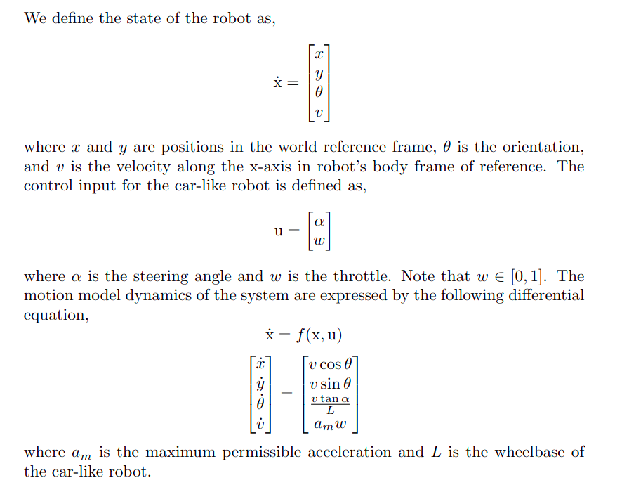

# MPC for Path Tracking and Obstacle Avoidance
## Note: README under construction

## Initial Steps
```bash
# Create a catkin workspace
mkdir -p ~/your_ws/src && cd ~/your_ws/src
# Cloning repositories
git clone https://github.com/hamdaan19/gem_navigator.git
# For creating the simulation with obstacles
git clone https://github.com/hamdaan19/POLARIS_GEM_e2.git
```

## Run with Docker
### Build the Docker Image
```
cd ~/your_ws/src/gem_navigator
# Build the image
xhost +local:docker # For attaching host's display
docker build -t gem_navigator_image . 
# Run the container
./run_container
# Enter into the container with Zsh
docker exec -it gem_nav_container zsh 
# Inside the container
cd /home/gem_ws 
# Initialize and build packages in workspace
catkin init && catkin build
# Source workspace
source /home/gem_ws/devel/setup.zsh
```

### Running the simulation 
The following `roslaunch` command needs to be run inside the container after building the catkin workspace. The file `navigator.launch` creates a world with obstacles, spawns the car, runs the necessary nodes for path tracking, trajectory planning, etc. 
```
roslaunch gem_navigator navigator.launch
```
In a new terminal, run the node which publishes path that needs to be tracked by the MPC controller. This node sends a set of waypoints to the trajectory planner which in turn plans a trajectory and passes it to the controller. 
```
rosrun gem_navigator path_publisher.py
```
After running the above command, the car will begin to move. 

## ROS Nodes Description 
| Sl. no. | Name | Description | Topics Subscribed | Topics Published |
| --- | --- | --- | --- | --- |
| 1. | mpc_controller.py | Contains class for MPC's implementation | /reference_path (`nav_msgs/Path`), closest_obstacle_location (`geometry_msgs/Point`), /gem/base_footprint/odom (`nav_msgs/Odometry`) | /gem/ackermann_cmd (`ackermann_msgs/AckermannDrive`) |
| 2. | time_optimal_trajectory_planner.py | Plans a kino-dynamically feasible trajectory with given set of waypoints | /path_waypoints (`geometry_msgs/PoseArray`) | /reference_path (`nav_msgs/Path`) | 
| 3. | path_publisher.py | Publishes a set of waypoints | - | /path_waypoints (`geometry_msgs/PoseArray`) |
| 4. | esdf_simulator.cc | A simulator for an ESDF. Broadcasts the location of the closest obstacle to the robot's state | /gem/base_footprint/odom (`nav_msgs/Odometry`) | /closest_obstacle_location (`geometry_msgs/Point`) |

## Parameters
* The parameters for the MPC controller are contained in `parameters.yaml` which is uploaded to the ROS Parameter Server in `launch/navigator.launch`. 
* Waypoints are contained `waypoints/wps.csv`. 

## Dynamic Model 
<!--  -->


## Optimization Problem
